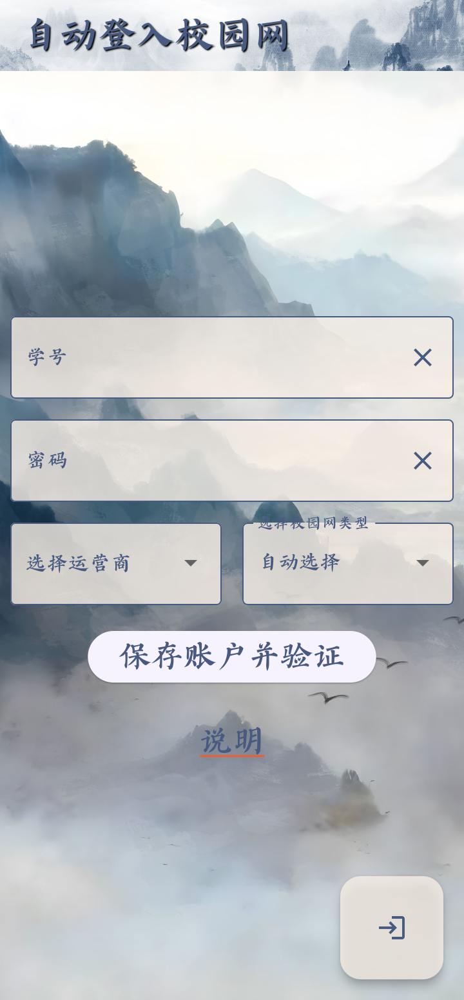
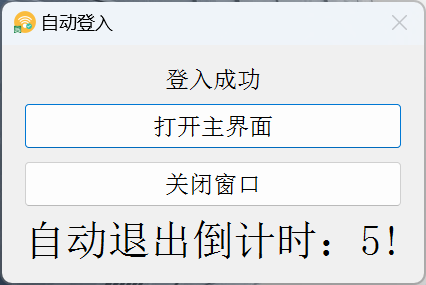

  

<h1 align="center">自动登入ECJTU校园网</h1>

丝滑连接校园网，支持ECJTU_Stu和EcjtuLib_Free

## 下载与安装

- 安装包已经上传至[蓝奏云网盘](https://wwaw.lanzouj.com/b052h91gb)，提取码：ecjt

## 使用方法-Android
基于flutter开发

### 添加校园网账户

- 输入学号，密码和运营商，关闭移动数据，打开WiFi连接校园网

- 然后点击“保存账户并验证”，同意位置请求，即可进行验证

- 验证通过后，自动保存账户

### 使用

- 只需点击右下角的按钮，即可连接校园网。

- 当你未登录校园网时，打开应用会自动帮你连接到校园网。

- 程序在后台运行，当切换回应用时，会自动连接到校园网。

### 其他功能

- 在“说明”中看

## 使用方法-Win
基于python开发

### 添加校园网账户

- 下载压缩文件或exe单文件后，压缩文件解压到任意目录，exe文件直接使用，双击`AuinEcjtuWifi.exe`或`AuinEcjtuWifi-upx`即可运行程序。

- 如果是第一次运行，会在C：\Auto_Login_ECJTU_Wifi_Data文件夹下自动创建相关的配置文件。

- 打开后在用户界面输入学号和密码，以及运营商，并选择你使用的网络（ECJTU_Stu、EcjtuLib_Free或自动选择），之后点击“保存账户”按钮保存你的账户信息。

- 保存账户后无法对账户信息进行修改，如果需要修改账户信息，需要点击“修改账户”按钮，然后修改你的账户信息，再点击“保存账户”按钮保存新的账户信息。

- 最后，点击“验证账户”按钮，对账户进行验证，验证成功后，校园网账户添加成功，解锁自动连接校园网功能。

### 自动连接校园网

- 解锁自动连接校园网功能后，每次运行程序，尝试自动连接校园网，并运行一个对话窗口进行提示，无操作几秒后自动退出。

- 在2.2版本中添加后台监测功能，需要打开主界面，然后点击页面右上角的“托盘运行”按钮，程序会自动最小化到系统托盘，然后在后台监测网络连接，如果检测到网络连接断开，会自动尝试重新连接校园网。

### 设置

- 在设置页面可以添加桌面快捷方式，设置开机自启动，以及修改监测校园网功能的间隔时间。

### 其他

- 还有一些并不重要的功能未在此列出，可以自行尝试。

## 安全声明

- 数据安全性：为了确保您的隐私和敏感数据的安全，我们承诺不会上传任何文件，包括您的个人信息和敏感数据。您可以放心使用本程序，因为您的数据不会通过此应用泄露。

- 警示： Win端的个人数据暂未进行加密处理，为了确保您的个人信息的安全性，请避免与他人分享您的个人信息和敏感数据。尽量避免在公共场所或不受信任的网络环境中使用本程序，并确保您的设备受到适当的安全保护措施。

谢谢您的理解和支持！

## 许可证

本程序遵循 [MIT 许可证](https://opensource.org/license/mit/)。

更多关于 MIT 许可证的详细信息，请访问 [MIT 开源许可证](https://opensource.org/license/mit/) 的官方网站。

## 常见问题（FAQ）

- 关于校园网登入失败问题，确保学号，密码，运营商无误后，在网页尝试登入，如果同样无法登入，请去相应运营商（电信、联通、移动）的交流群咨询相关问题。

## 联系信息

邮箱：atuzkb@outlook.com

如果你发现了任何BUG，请通过的联系方式联系我